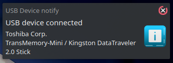
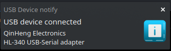

## Simple usb notifier
Display notifications (using notify-send) in linux about connected USB devices  

- Simple - one bash script and one udev rule.
- Uses notify-send  

### Download && Use
#### Debian/*ubuntu:  
Download [latest](https://github.com/Mr-Precise/simple-usb-notifier/releases/latest) release and install sudo dpkg -i .deb package 

### Manual install  
Download [zip](https://github.com/Mr-Precise/simple-usb-notifier/archive/refs/heads/main.zip) or use git  
`git clone https://github.com/Mr-Precise/simple-usb-notifier/`  

#### Install dependencies:  
Debian/*ubuntu:  
`sudo apt install libnotify-bin`  
Manjaro/Arch:  
`sudo pacman -S libnotify`  

copy `99-usb-notification.rules` to udev rules folder (default in `/etc/udev/rules.d/`)  
copy `susb-notifier` to `/usr/bin/`  

Reload udev ruled:  
```bash
udevadm control --reload-rules
systemctl restart udev
```

To build the package yourself:
```bash
sudo apt install dpkg-dev
fakeroot
dpkg -b simple-usb-notifier
exit
```

Result:

 
